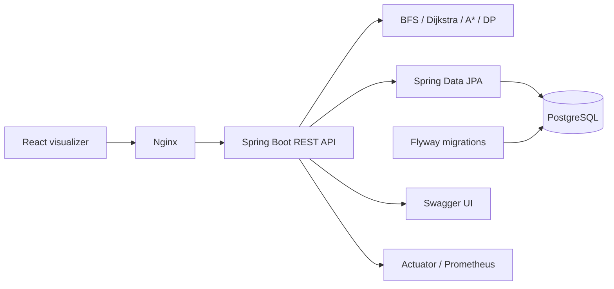

# Pathfinder Lab

[](https://github.com/tejdeeppathipati/Grid-Based-Pathfinder/actions/workflows/ci.yml)
[](https://openjdk.org/projects/jdk/21/)
[](https://spring.io/projects/spring-boot)
[](https://react.dev/)
[](LICENSE)

Pathfinder Lab is an interactive platform for building weighted grids, visualizing routes, and comparing pathfinding algorithms. It combines a React grid editor with a production-style Spring Boot API, persistent search history, API documentation, automated tests, and containerized deployment.

## Highlights

- Draw obstacles and weighted cells in an interactive 10×10 grid.
- Move start and destination points directly from the UI.
- Run BFS, Dijkstra, or A* and visualize the resulting route.
- Compare path cost, step count, visited cells, and execution time.
- Find the maximum-scoring top-to-bottom route with dynamic programming.
- Save grids and inspect paginated search history in PostgreSQL.
- Explore and test every endpoint through Swagger UI.
- Run the complete stack with a single Docker Compose command.

## Quick start

The easiest way to run the complete application is with Docker Desktop and Docker Compose:

```bash
git clone https://github.com/tejdeeppathipati/Grid-Based-Pathfinder.git
cd Grid-Based-Pathfinder
docker compose up --build
```

Once the services are healthy, open:

| Service | URL |
| --- | --- |
| Interactive visualizer | [http://localhost:3000](http://localhost:3000) |
| Swagger UI | [http://localhost:8080/swagger-ui.html](http://localhost:8080/swagger-ui.html) |
| API health | [http://localhost:8080/actuator/health](http://localhost:8080/actuator/health) |

Stop the stack with `docker compose down`. To also remove the local PostgreSQL volume, run `docker compose down -v`.

## Using the visualizer

1. Select a drawing tool: **wall**, **weight**, **start**, or **destination**.
2. Click grid cells to edit the board.
3. Choose BFS, Dijkstra, or A*.
4. Select **Run search**.
5. Review the highlighted path and its cost, steps, visited-cell count, and runtime.

BFS minimizes the number of steps and ignores weights. Dijkstra and A* minimize total weight and require traversable cell weights of at least `1`. In API payloads, `null` represents an obstacle.

## Algorithms

| Algorithm | Optimizes | Typical use | Complexity |
| --- | --- | --- | --- |
| BFS | Fewest steps | Unweighted grids | `O(V + E)` |
| Dijkstra | Lowest total cost | Weighted grids | `O((V + E) log V)` |
| A* | Lowest total cost | Goal-directed weighted search | `O((V + E) log V)` worst case |
| Dynamic programming | Highest top-to-bottom score | Downward three-way movement | `O(rows × columns)` |

Search results are deterministic. BFS explores neighbors in a fixed order, while weighted searches use stable coordinate-based tie-breaking.

For detailed recurrences, correctness reasoning, and flowcharts, see the [Algorithm Guide](docs/ALGORITHMS.md).

## API overview

All application endpoints are versioned under `/api/v1`.

| Method | Endpoint | Description |
| --- | --- | --- |
| `POST` | `/paths/search` | Run BFS, Dijkstra, or A* |
| `POST` | `/paths/compare` | Compare all point-to-point algorithms |
| `POST` | `/paths/shortest` | Run the compatibility BFS endpoint |
| `POST` | `/paths/best` | Find the maximum-score downward route |
| `POST` | `/grids/analysis` | Calculate grid and weight statistics |
| `POST` | `/saved-grids` | Save a named grid |
| `GET` | `/saved-grids` | List saved grids with pagination |
| `GET` | `/saved-grids/{id}` | Retrieve a saved grid |
| `PUT` | `/saved-grids/{id}` | Replace a saved grid |
| `DELETE` | `/saved-grids/{id}` | Delete a grid and its history |
| `POST` | `/saved-grids/{id}/searches` | Run and record a search |
| `GET` | `/saved-grids/{id}/searches` | View paginated search history |

Example A* request:

```bash
curl --request POST http://localhost:8080/api/v1/paths/search \
  --header 'Content-Type: application/json' \
  --data '{
    "grid": [
      [1, 3, 1, 1],
      [1, null, 8, 1],
      [1, 1, 1, 1]
    ],
    "start": { "row": 0, "column": 0 },
    "destination": { "row": 2, "column": 3 },
    "algorithm": "ASTAR"
  }'
```

Example response:

```json
{
  "algorithm": "ASTAR",
  "steps": 5,
  "totalCost": 5,
  "visitedCells": 7,
  "durationNanos": 148320,
  "path": [
    { "row": 0, "column": 0 },
    { "row": 1, "column": 0 },
    { "row": 2, "column": 0 },
    { "row": 2, "column": 1 },
    { "row": 2, "column": 2 },
    { "row": 2, "column": 3 }
  ]
}
```

Invalid requests return [RFC 9457 Problem Details](https://www.rfc-editor.org/rfc/rfc9457). A well-formed grid with no available route returns HTTP `422`.

## Local development

### Backend

Requirements: JDK 21 and Maven 3.9 or newer.

```bash
mvn spring-boot:run
```

The default development configuration uses an in-memory H2 database in PostgreSQL compatibility mode. Flyway applies the same versioned schema used by PostgreSQL.

To connect to PostgreSQL directly, provide:

```bash
export DATABASE_URL='jdbc:postgresql://localhost:5432/pathfinder'
export DATABASE_USERNAME='pathfinder'
export DATABASE_PASSWORD='pathfinder'
mvn spring-boot:run
```

### Frontend

Requirements: Node.js 22 or newer.

```bash
cd frontend
npm ci
npm run dev
```

Vite serves the application at `http://localhost:5173` and proxies `/api` requests to the backend on port `8080`.

## Testing

```bash
# Backend unit, MVC, context, and integration tests
mvn verify

# Frontend tests and production build
cd frontend
npm ci
npm test
npm run build
```

PostgreSQL integration tests use Testcontainers and automatically skip when Docker is unavailable. GitHub Actions runs the backend and frontend verification jobs for pushes and pull requests.

## Architecture



The HTTP, service, algorithm, domain, and persistence concerns are separated so the core pathfinding behavior can be tested without starting Spring or connecting to a database. See [Architecture](docs/ARCHITECTURE.md) for component, request-flow, and testing diagrams.

## Project structure

```text
.
├── frontend/                  React, TypeScript, Vite, and Nginx
├── src/main/java/             API, algorithms, services, and persistence
├── src/main/resources/        Configuration and Flyway migrations
├── src/test/                  JUnit, MockMvc, and Testcontainers tests
├── docs/                      Architecture and algorithm documentation
├── docker-compose.yml         Full local application stack
└── pom.xml                    Maven build and dependency configuration
```

## Technology stack

- Java 21, Spring Boot, Spring Data JPA, Bean Validation, and Actuator
- PostgreSQL, H2, Flyway, and Testcontainers
- React, TypeScript, Vite, Vitest, and Nginx
- JUnit 5, AssertJ, Mockito, MockMvc, Maven, and GitHub Actions
- Docker and Docker Compose

## License

This project is available under the [MIT License](LICENSE).
