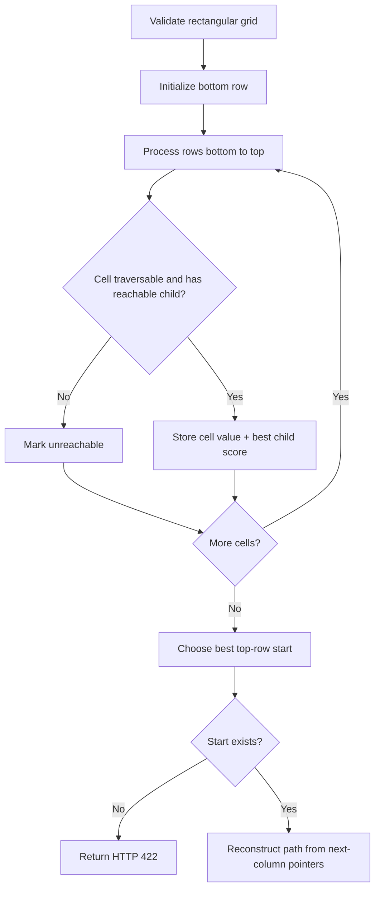
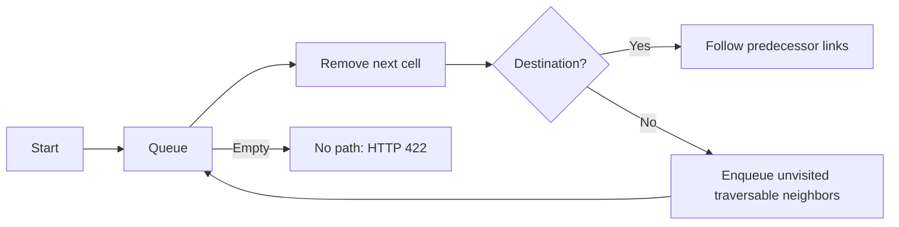

# Algorithm Guide

This project deliberately exposes two different pathfinding problems. They look similar on a grid, but optimize different goals and therefore need different algorithms.

## Maximum-score top-to-bottom path

`PathfinderService` finds the highest-scoring complete route from the first row to the last. From `(row, column)`, a route may move to the next row at `column - 1`, `column`, or `column + 1`. Obstacles cannot be entered.

### Dynamic-programming recurrence

Let `best[r][c]` be the best score obtainable from cell `(r,c)` through the bottom row:

```text
best[r][c] = grid[r][c] + max(
    best[r + 1][c - 1],
    best[r + 1][c],
    best[r + 1][c + 1]
)
```

Out-of-bounds cells, obstacles, and cells that cannot reach the bottom are marked unreachable. The last row is the base case. The solver fills the table from bottom to top, stores the selected next column, chooses the best cell in row zero, and follows those pointers to reconstruct the path.



- Time: `O(rows × columns)`
- Space: `O(rows × columns)` for scores and path reconstruction
- Tie-breaking: leftmost start, then leftmost next cell
- Supports negative cell values

The original recursive approach recalculated the same subproblems and could incorrectly prefer incomplete routes. Dynamic programming eliminates both issues.

## Point-to-point shortest path

`ShortestPathService` provides the original BFS endpoint. `PathSearchService` exposes BFS, Dijkstra, and A* through one request contract. Movement is allowed up, down, left, and right.

BFS is appropriate because every move has equal cost. It explores cells in distance layers, so the first time it removes the destination from the queue, that route is guaranteed to use the minimum number of steps. A predecessor matrix reconstructs the route.



- Time: `O(rows × columns)`
- Space: `O(rows × columns)`
- Neighbor order: up, left, right, down for deterministic output
- Cell weights do not affect BFS; only traversability matters

### Dijkstra

Dijkstra uses a priority queue ordered by cumulative cost. Entering a cell costs that cell's positive weight; the starting cell has zero entry cost. Once a cell is removed with the smallest unsettled distance, its best cost is final.

### A*

A* uses the same relaxation logic and adds Manhattan distance to the priority. Because weighted searches require every traversable weight to be at least one, Manhattan distance never overestimates the remaining cost and is admissible. It therefore preserves Dijkstra's optimal result while often visiting fewer cells.

The comparison endpoint runs all three strategies and reports path length, total cost, visited cells, and elapsed nanoseconds. Timing is useful for observability, while serious JVM microbenchmarks should use JMH with warmup and repeated forks.

For BFS, `totalCost` equals the number of steps. Dijkstra and A* minimize weights, so their paths can contain more steps while costing less.

## Grid analysis

`GridAnalysisService` makes one pass over the grid to calculate dimensions, traversable and obstacle counts, obstacle percentage, and weight statistics.

- Time: `O(rows × columns)`
- Extra space: `O(1)`

## Edge-case policy

- `null` means obstacle; zero and negative numbers remain valid weights.
- Empty, jagged, or missing grids return HTTP `400`.
- Invalid or blocked start/destination positions return HTTP `400`.
- A valid request with no complete route returns HTTP `422`.
- Score arithmetic is checked for overflow.
