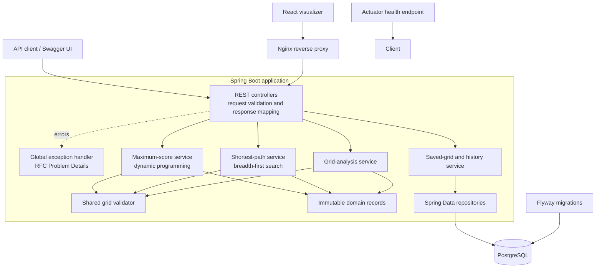
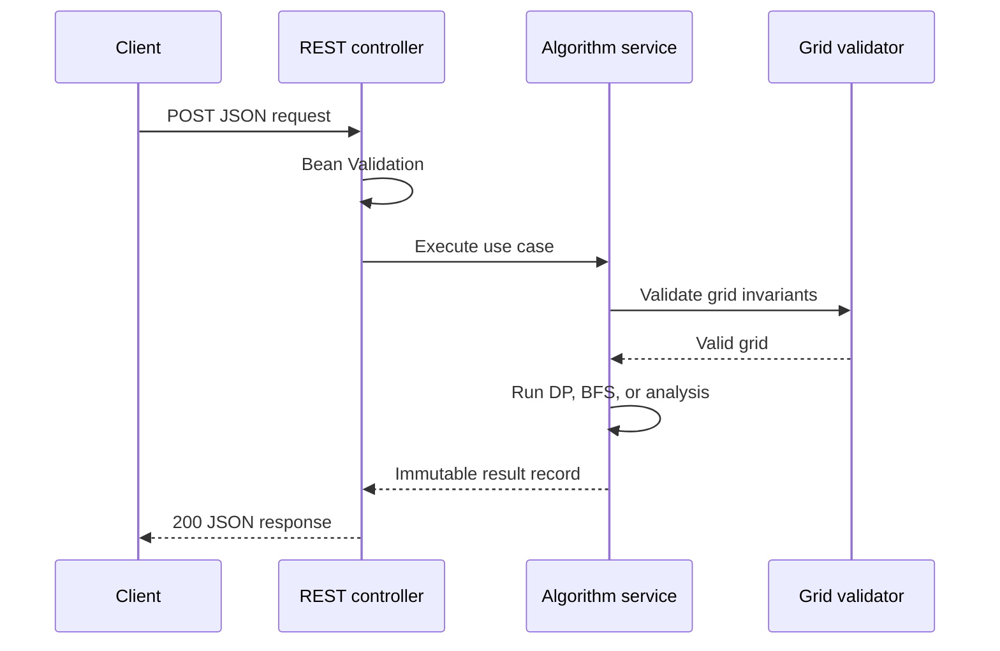
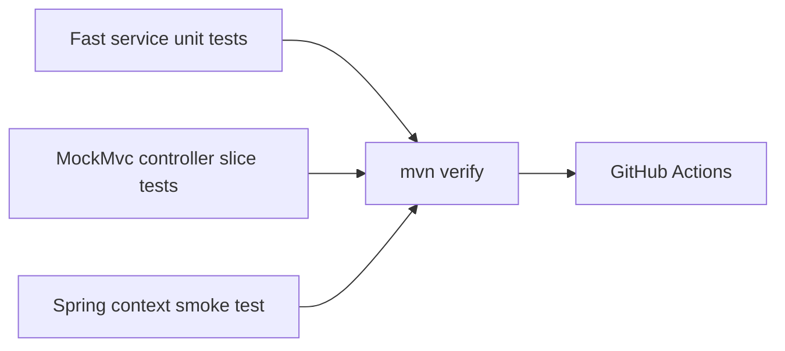

# Architecture

The application uses a conventional layered architecture. HTTP and algorithm code remain separate, which keeps the core logic easy to unit test and makes transport changes inexpensive.

## Package responsibilities

| Package | Responsibility |
| --- | --- |
| `com.gridpathfinder.api` | Versioned HTTP endpoints, request DTOs, Bean Validation, error translation |
| `com.gridpathfinder.service` | Algorithms, grid rules, and use-case orchestration |
| `com.gridpathfinder.domain` | Immutable result and coordinate records |
| `com.gridpathfinder.persistence` | JPA entities and Spring Data repositories |
| `frontend/src` | React grid editor, visualization state, and typed API client |

## Request flow

Failures thrown by the service layer are translated centrally into predictable `application/problem+json` responses.

## Testing strategy

- Service tests cover algorithm correctness and boundary conditions without starting Spring.
- MockMvc slice tests verify routing, JSON contracts, validation, and status codes.
- The context test catches dependency-wiring and configuration failures.
- CI builds with Java 21 on pushes and pull requests.

## Deliberate scope

Ad-hoc searches remain stateless, while saved grids provide an optional persistence workflow. This keeps algorithms independently testable: persistence orchestrates searches but does not live inside the algorithm implementations. H2 provides a zero-setup local profile; Docker and production use PostgreSQL with the same Flyway-managed schema.
